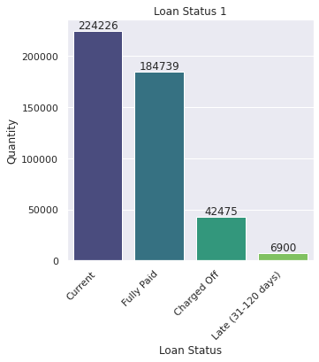
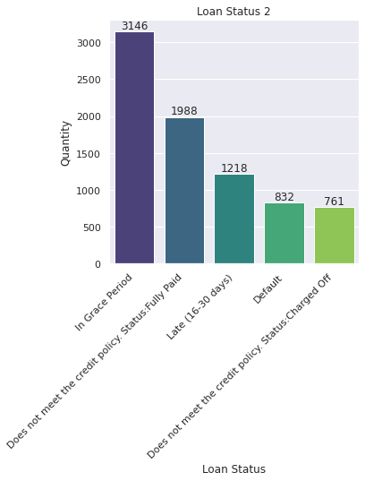
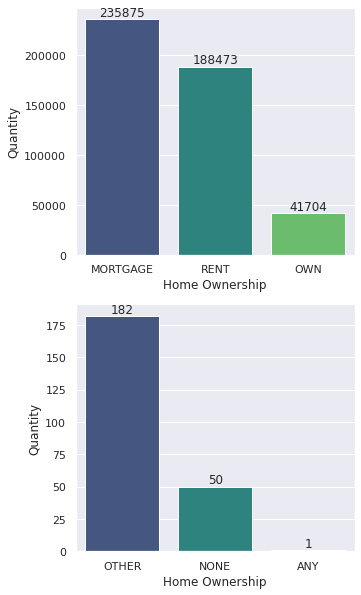
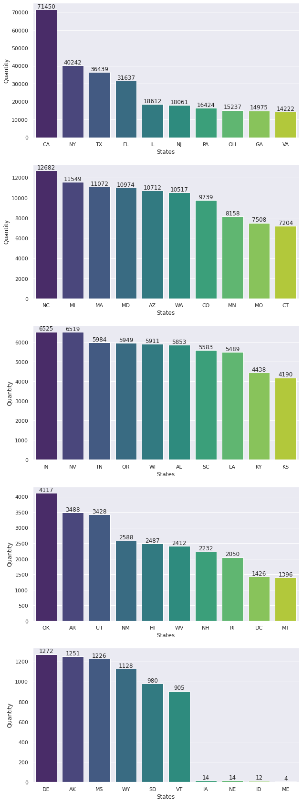

## Integrantes

- Camilo Loaiza Fonnegra
- Juan Pablo Rivera Sierra
- Eduardo Santos Ruiz
- Juan Diego Marin Rodriguez
- Ivan Andrés Velasco Arias

## Planteamiento del Problema

### Objetivo:

* Crear un modelo para predecir la probabilidad de que un individuo incumpla sus obligaciones financieras en los siguientes 12 meses a la fecha de originación de su crédito.

### Tipo de Problema:

* Problema de predicción de la probabilidad de que un individuo incumpla sus obligaciones financieras en los siguientes 12 meses a la fecha de originación de su crédito.

### Información Disponible:

* El insumo principal de este trabajo son los datos de las solicitudes de préstamo encontradas en [Loan_data_2007_2014](https://drive.google.com/file/d/1M0UVAKomoPEPjmzhxOYb3H_yyHRx_9dE/view) (466285 registros).

### Método de Machine Learning:

* Realización de dos modelos, uno de redes neuronales y otro de regresión logística. Ambos con el fin de realizar la predicción de riesgo de crédito.
    
    * Para ambos modelos se realizó un análisis exploratorio de datos evaluando una gran cantidad de características sin hipótesis pre-especificadas para identificar y seleccionar las características que sirvan como variables predictivas y variable a predecir.
    * Para la realización del modelo de redes neuronales se seleccionaron todas las características contenidas en el conjunto de datos debido a que esto permite una mejor rendimiento del modelo. 
    * Para la realización del modelo de regresión logística se seleccionaron 10 características utilizando el método Recursive Feature Elimination (RFE) ya que su objetivo es seleccionar características considerando de forma recursiva conjuntos de características cada vez más pequeños.

### Evaluación de Métricas, Protocolo de Entrenamiento y Validación:

* accuracy, precision, recall, f1-score y support serán utilizados para evaluar el rendimiento predictivo de los modelos de regresión logística y redes neuronales. Adicionalmente, se utilizará la matriz de confusión y la curva de ROC para evaluar el modelo de regresión logística.
* 311832 registros de solicitudes de préstamo para entrenamiento y 153590 registros para validación. Se utilizó la misma partición para ambos modelos ya que se considero adecuada para ambos. Además, se utilizó el parámetro stratify para combatir el desbalance presente en los conjuntos para las particiones de ambos modelos.

## Definiciones

* Se considerará que un cliente cumple sus obligaciones financieras si no está en default o si no tiene un atraso de más de 30 días en su pago.
* Se considerará que un cliente incumple sus obligaciones financieras si está en default o si tiene un atraso de más de 30 días en su pago.

## Análisis Descriptivo

A continuación se realiza un análisis descriptivo a algunas de las características encontradas en nuestra base de datos.

### Estado de crédito ('loan-status')

El estado de crédito se clasifica en lo siguiente: Current (Actual), Fully Paid (Completamente pagado), Charged Off (Cobrado), Late (En mora), In Grace Period (En período de gracia), Does not meet the credit policy (No cumple con la política de crédito) y Default (Incumplimiento).

*Figura 1*. Loan Status 1. Fuente propia.

*Figura 2*. Loan Status 2. Fuente propia.

Al observar los gráficos de barras, se concluye que las personas por lo general tienen un crédito actual o lo han pagado por completo (Véase Loan Status 1).

Ahora, se muestra la cantidad de personas en el estado Default y las que no están con aquel estado. En el caso de Default se considera que, aquellos que tienen el estado Late (31-120 days), también entran en Default.

*Figura 3*. Loan Status 3. Fuente propia.

Al ver los resultados, se concluye que la gran mayoría que solicitaron crédito no se encuentran en estado de Default, es decir que cumplen con sus obligaciones financieras.

### Propiedad de la vivienda ('home_ownership')

El tipo de propiedad de vivienda puede influenciar en la solicitud de crédito. Aquí se muestra, por medio de una gráfica de barras, la cantidad de personas que solicitaron crédito según su tipo de propiedad de vivienda.

La propiedad de vivienda se clasifica de la siguiente manera: MORTGAGE (Hipoteca), RENT (Renta), OWN (Propietario), OTHER (Otro), NONE (Ninguno) o ANY (Alguno).

*Figura 4*. Home Owenrship. Fuente propia.

Se realizaron dos gráficos de barras debido a que la escala del primer gráfico no permitía ver la cantidad de datos de algunos tipos de propiedad. Ahora, se observa que la mayoría de personas que solicitaron crédito viven en hipoteca o rentan.

### Estado del solicitante ('addr_state')

Los siguientes son estados de EEUU donde residen los solicitantes de crédito:

California (CA), New York (NY), Texas (TX), Florida (FL), Illinois (IL), New Jersey (NJ), Pensilvania (PA), Ohio (OH), Georgia (GA), Virginia (VA), North Carolina (NC), Michigan (MI), Massachusetts (MA), Maryland (MD), Arizona (AZ), Washington (WA), Colorado (CO), Minnesota (MN), Missouri (MO), Connecticut (CT), Indiana (IN), Nevada (NV), Tennessee (TN), Oregon (OR), Wisconsin (WI), Alabama (AL), South Carolina (SC), Louisiana (LA), Kentucky (KY), Kansas (KS), Oklahoma (OK), Arkansas (AR), Utah (UT), New Mexico (NM), Hawaii (HI), West Virginia (WV), New Hampshire (NH), Rhoad Island (RI), District of Columbia (DC), Montana (MT), Delaware (DE), Alaska (AK), Mississippi (MS), Wyoming (WY), South Dakota (SD), Vermont (VT), Iowa (IA), Nebraska (NE), Idaho (ID) y Maine (ME).

*Figura 5*. States. Fuente propia.

Al ver la gráfica de barras podemos concluír que el estado donde hay más personas que solicitaron crédito es California.

## Fuentes de Datos y Preprocesamiento

### Poblaciones:

* Solicitudes de préstamo realizadas por individuos que cumplen sus obligaciones financieras en los siguientes 12 meses a la fecha de originación de su crédito.
* Solicitudes de préstamo realizadas por individuos que incumplen sus obligaciones financieras en los siguientes 12 meses a la fecha de originación de su crédito.

### Registro de Muestra y Características de Medición:

* Datos obtenidos de las solicitudes de préstamo encontradas en [Loan_data_2007_2014](https://drive.google.com/file/d/1M0UVAKomoPEPjmzhxOYb3H_yyHRx_9dE/view) (466285 registros).

### Recopilación de Datos:

* Registros de solicitudes seleccionados de la base de datos a partir de las definiciones presentadas en este trabajo.

### Estructuras de Datos y Tipos:

* Variables continuas seleccionadas de la base de datos.

### Preprocesamiento de Datos:

* Para ambos modelos se realizó el mismo preprocesamiento de datos:
    1. Eliminación de columnas que contienen valores nulos (NaN) en su totalidad.
    2. Eliminación de columnas que contienen gran diversidad de valores únicos como por ejemplo 'emp_title', 'desc' y 'title'.
    3. Creación de nuevas columnas extrayendo el año de las columnas que poseen fechas.
    4. Eliminación de las columnas 'id', 'member_id', 'grade', 'url', 'zip_code', 'application_type', 'addr_state' debido a que son poco aportantes para la predicción.
    5. Creación de nuevas columnas dummies con valores binarios para las columnas tipo object.
    6. Eliminación de las columnas que presentan un gran porcentaje de datos faltantes, es decir, que contienen gran cantidad de valores nulos (NaN).
    7. Reemplazo de los valores nulos (NaN) de las columnas 'tot_coll_amt' y 'tot_cur_bal' por su media debido a que el porcentaje de valores nulos (NaN) no se considera alto.
    8. Eliminación de filas que contienen valores nulos (NaN) pero que cuyo porcentaje de valores faltantes no se considera alto.
    9. Transformación de la variable 'loan_status' a binaria teniendo en cuenta las definiciones presentadad en este trabajo.

### Link a la Información:

* [Loan_data_2007_2014](https://drive.google.com/file/d/1M0UVAKomoPEPjmzhxOYb3H_yyHRx_9dE/view).

## Desarrollo de los Modelos y Validación

### Software Utilizado:

* Modelo realizado en [Google Collaboratory](https://www.google.com/url?q=https://colab.research.google.com/notebooks/welcome.ipynb?hl%3Des&sa=D&source=editors&ust=1651468799400076&usg=AOvVaw3BsmzIFA0LLERerLBE2zcG) con el lenguaje de programación Python utilizando las librerías [Sklearn](https://scikit-learn.org/stable/) y [Tensorflow](https://www.tensorflow.org/?hl=es-419).
* Scorecard realizado en [Google Collaboratory](https://www.google.com/url?q=https://colab.research.google.com/notebooks/welcome.ipynb?hl%3Des&sa=D&source=editors&ust=1651468799400076&usg=AOvVaw3BsmzIFA0LLERerLBE2zcG) con el lenguaje de programación Python utilizando la librería [Optbinning](http://gnpalencia.org/optbinning/).

### Entrenamiento y Validación de los Modelos:

* Entrenamiento completado para ambos modelos utilizando 311832 registros de solicitudes de préstamo.

### Características Seleccionadas y Entrada a los Modelos:

* Para el modelo realizado con redes neuronales se utilizaron todas las características obtenidas después de la realización del preprocesamiento de datos.
* Para el modelo realizado con regresión lineal se utilizaron las siguientes 10 características: 'funded_amnt', 'funded_amnt_inv', 'installment', 'total_acc', 'out_prncp', 'out_prncp_inv', 'total_pymnt', 'total_rec_prncp', 'total_rec_int', 'total_rec_late_fee' obtenidas utilizando el método RFE.

### Variable a Predecir y Salida de los Modelos:

* Al realizar el análisis exploratorio en la base de datos se identificó que la variable ‘loan_status’ permite demostrar si un individuo icumplirá o no en sus obligaciones financieras en los siguientes 12 meses a la fecha de originación de su crédito.

### Método de Validación:

* Validación realizada para ambos modelos utilizando 153590 registros de solicitudes de préstamo.

### Reproducibilidad y Reutilización del Código:

* Modelos para la predicción de riesgo de crédito:

    * [código fuente en Google Colab](https://colab.research.google.com/drive/1rsg987aRolJxyVOgruQKJAreqXiG-CGT?usp=sharing)
    * [código fuente en Github](https://github.com/CloaizaF/Trabajo_TAE_2)

* Código fuente de la aplicación web:

    * [backend](https://github.com/jumarinr/trabajos-tae-ui)
    * [frontend](https://github.com/jumarinr/endpoints_tae)

## Modelo en Producción

* [Link a la aplicación web](https://trabajos-tae.herokuapp.com/trabajo-2)

## Video Promocional

* [Link al video promocional](https://youtu.be/oIILYVWESIw)

## Conclusiones 

* Al ser una muestra tan asimétrica con respecto al número de solicitudes de individuos que incumplen sus obligaciones financieras y los que no, siendo estos primeros una minoría, se deben analizar otras métricas además de la exactitud de los modelos (la cual es similar en ambos modelos), como por ejemplo la precisión, ya que nos indica la calidad de la precisión realizada con respecto a los verdaderos positivos, divididos entre los positivos identificados, ya sean correctos o incorrectos.
* A pesar de que ambos modelos presentan resultados muy similares tanto en entrenamiento como en validación, se puede obsearvar que el modelo de redes neuronales presenta mejores métricas respecto al modelo de regresión lineal, debido a que logra identificar a los individuos que incumplirían sus obigaciones financieras de manera más confiable, incluso teniendo en cuenta que se tiene una muestra desigual respecto a los que incumplen sus obligaciones financieras y los que no.
* Aunque las métricas del modelo de redes neuronales son mejores que las métricas del modelo de regresión lineal, se escogió este último para realizar el scorecard debido a que es más adecuado para la realización de scorecards.

## Referencias

Bhalla, D. (s. f.). A Complete Guide to Credit Risk Modelling. ListenData. https://www.listendata.com/2019/08/credit-risk-modelling.html

DataCamp. (s. f.). Python Logistic Regression Tutorial with Sklearn & Scikit. Desconocido. https://www.datacamp.com/tutorial/understanding-logistic-regression-python
F. (2021, 15 septiembre). 🏦 Lending Club Loan 💰 Defaulters 🏃‍♂ Prediction. Kaggle. https://www.kaggle.com/code/faressayah/lending-club-loan-defaulters-prediction/notebook

Gonçalves, G. D. S. (2022, 7 enero). Developing Scorecards in Python using OptBinning - Towards Data Science. Medium. https://towardsdatascience.com/developing-scorecards-in-python-using-optbinning-ab9a205e1f69

Li, S. (2019, 27 febrero). Building A Logistic Regression in Python, Step by Step. Medium. https://towardsdatascience.com/building-a-logistic-regression-in-python-step-by-step-becd4d56c9c8

Mumtaz, A. (2021, 15 diciembre). How to Develop a Credit Risk Model and Scorecard | Towards Data Science. Medium. https://towardsdatascience.com/how-to-develop-a-credit-risk-model-and-scorecard-91335fc01f03

Property, K. T. |. (2022, 30 marzo). Intro to Credit Scorecard - Towards Data Science. Medium. https://towardsdatascience.com/intro-to-credit-scorecard-9afeaaa3725f

¿Qué es un puntaje de FICO? | Oficina para la Protección Financiera del Consumidor. (2016, 13 junio). Consumer Financial Protection Bureau. https://www.consumerfinance.gov/es/obtener-respuestas/que-es-un-puntaje-de-fico-es-1883/
